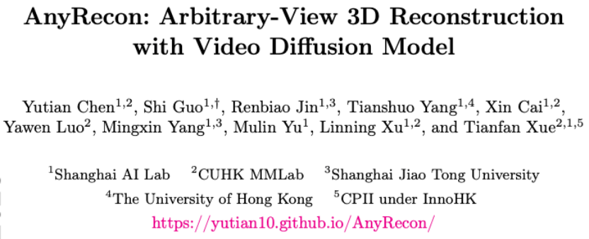

论文概览 (Overview)
标题：AnyRecon: Arbitrary-View 3D Reconstruction with Video Diffusion Model
译文：AnyRecon：基于视频生成模型的任意视角三维重建
论文：https://arxiv.org/pdf/2604.19747
项目网页：https://yutian10.github.io/AnyRecon/
Code: https://github.com/OpenImagingLab/AnyRecon
作者和机构：

发表期刊/会议及年份: 刚刚提交ArXiv+公开模型
一句话总结: AnyRecon支持任意数量、无序的采集视角输入，进行任意新视角的重建，可以处理复杂的长轨迹场景。 为将日常随意采集视频数据规模化转化为可自由探索三维场景提供一种解决方案。

2. 研究背景与核心问题 (Background & Research Question)

研究背景
稀疏视角 3D 重建是计算机视觉与图形学的核心任务，支撑 AR/VR、沉浸式虚拟环境、数字孪生等关键应用。现有主流方法（NeRF、3D 高斯泼溅）依赖密集采样、规则采集的多视图数据，而现实场景中，手持拍摄、网络视频等日常数据均为稀疏、无序、大视角间隔的不规则输入，难以直接适配。

核心问题
如何让视频扩散模型适配任意数量、无序的稀疏采集视角，打破固定参考帧限制？ 
如何在大视角间隔、长轨迹场景下，保证新视角生成的几何对齐与空间一致性？ 
如何平衡 3D 重建的精度与推理效率，实现大规模场景的实用化部署？

为什么重要
突破密集采集的约束，让日常随手拍摄的视频 / 图像，即可高效转化为可自由漫游的 3D 场景，大幅降低 3D 内容生产门槛，推动稀疏视角 3D 重建从实验室走向真实场景落地。

3. 核心贡献与创新点 (Key Contributions & Innovations)
AnyRecon 有以下技术亮点：
（1）打破视角限制： 不再局限于一两张参考图！AnyRecon支持任意数量、无序的输入，甚至可以处理复杂的长轨迹场景
（2）构建显隐双重记忆架构：我们结合了“显式 3D 几何记忆”与“隐式场景记忆”。这种双重约束确保模型在生成 novel views 时，始终与拍摄视角和过往生成内容保持一致。
（3）几何贡献度检索 ：改变了传统基于图像相似度/FoV的检索方式，引入几何贡献度检索机制，确保生成模块“读入”的上下文信息对当前重建片段最具价值。
（4）高效推理：我们通过 4 步扩散蒸馏及上下文窗口稀疏注意力机制，在利用视频扩散模型的高保真特性的同时，大幅压缩了计算复杂度。

4. 研究方法与实验设计 (Methodology & Experimental Design)

（1）初始几何条件信息构建
将输入视图存入采集库，通过PI3/VGGT 模型构建初始3D 几何记忆，生成点云渲染图与可见性掩码。
（2）新视角生成
几何驱动检索：筛选当前片段最有价值的参考视图；
无序上下文视频扩散：移除时间压缩，保留帧级像素对应关系；
全局场景记忆：将参考帧作为持久 KV 缓存，支持长程条件建模；
高效推理：4 步扩散蒸馏 + 上下文窗口稀疏注意力，降低计算复杂度。
（3）几何记忆更新
将新生成视图反投影更新 3D 点云，迭代优化全局几何，避免长轨迹漂移。

5. 关键结果与发现 (Key Results & Findings)

在 DL3DV、Tanks and Temples 基准上，插值 / 外推任务的 PSNR、SSIM 均超越 Difix3D+、ViewCrafter、Uni3C 等基线，LPIPS 显著降低。

6. 局限性与未来方向 (Limitations & Future Work)

基于14B模型，运行速度还是较慢。

一些结果整理：

