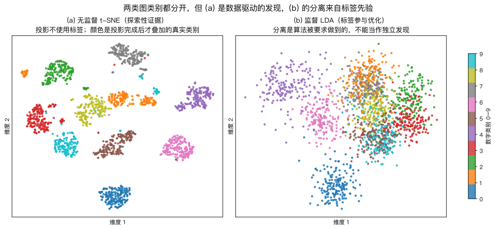
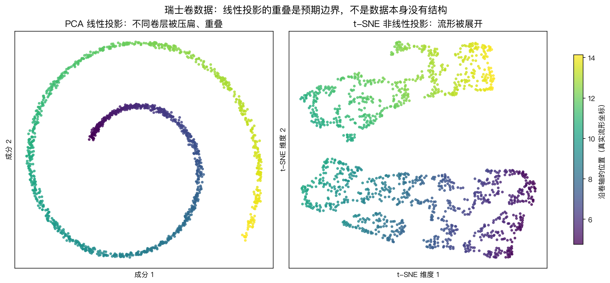
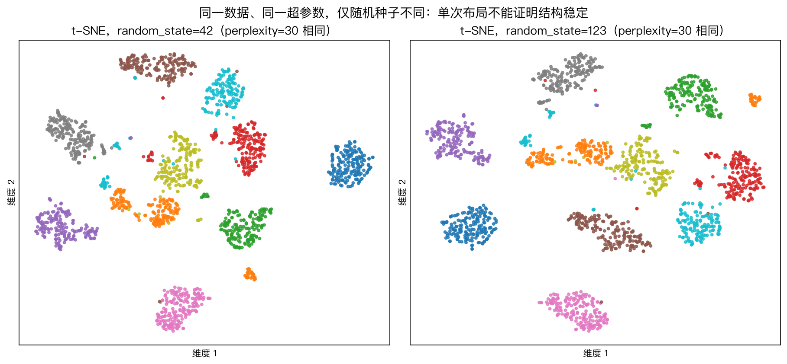

# t-SNE、PCA、UMAP 与 PaCMAP 怎样阅读和选择降维图

PCA、t-SNE、UMAP 和 PaCMAP 都能把高维样本变成二维或三维坐标，但它们保护的结构不同。降维图适合观察表示、发现疑点和形成待验证假设，模型性能仍需由独立测试集上的指标判断。

> t-SNE 更像观察高维表示的显微镜。模型表现需要另外看成绩单。

## 从一张 GCN 隐藏表示图开始

图卷积网络会为每个节点学习一个隐藏向量。假设第 $i$ 个节点的表示为

$$
h_i\in\mathbb{R}^{16}.
$$

人无法直接查看十六维空间。降维方法接收全部节点组成的矩阵 $H\in\mathbb{R}^{N\times16}$，为每个节点生成二维坐标 $y_i\in\mathbb{R}^{2}$。研究者随后按论文类别给散点着色。

Kipf 与 Welling 的 GCN 论文在 Figure 1 中采用了这种做法。[@kipfSemiSupervisedClassification2017] 同类节点在 t-SNE 图上形成局部聚集，可以支持一个有限判断。GCN 隐藏表示中存在类别相关的局部邻域。

这张图没有直接检验下面这些结论。

- 分类准确率是否很高
- 模型能否泛化到未见节点、未见图或分布变化
- 二维图中的每个簇是否对应高维空间中的真实簇
- 两个簇在图上相距很远时，它们在原空间是否同样遥远
- 换一个随机种子或邻域参数后，图形是否保持稳定

## 颜色什么时候加，能不能算证据

降维算法重新安排了坐标。投影后的二维坐标不是原始特征，坐标轴通常没有直接的物理或业务意义。t-SNE、UMAP 等方法以保护局部结构为主要目标，会系统地扭曲全局距离，簇的大小、簇间间距和簇的形状都不能直接当作结论读出。超参数、随机种子和预处理同样会改变图形。

### 无监督投影中，颜色是事后标注

无监督降维的常见流程是先不看标签完成投影，再把已知标签作为颜色叠上去，检查投影结果与类别的对应关系。颜色没有进入算法输入，只是事后标注。即便不同颜色的点在图上分开，这个观察也只说明表示结构与已知标签一致，属于探索性证据，不能替代正式验证。对称地，颜色大量混合也不能直接推出"表示没有类别信息"，它同样可能只是当前投影设置下的结果。

### 监督降维中，分离是算法被要求做到的结果

LDA、PLS-DA、监督 UMAP 和度量学习等方法把标签写进优化目标。此时图中的类别分离是算法被要求做到的结果，不能再被当作独立发现。这类似于用标签训练一个分类器，再在训练集上报告准确率。这个数字本身没有错，但它度量的是拟合效果，不是泛化能力。使用这类方法并不构成问题，问题在于必须把标签的角色写清楚。



同一批手写数字样本的两种投影。(a) 无监督 t-SNE 不使用标签，投影完成后再叠加真实数字类别，十个数字各自形成局部聚集，颜色与结构的对应属于探索性证据。(b) 监督 LDA 把类别写进优化目标，十个数字类别在二维投影中趋于分开而非完全分开，这种分离来自标签先验而非数据本身的结构，不能当作独立发现。

### 独立发现要求验证过程独立于标签

判断类别分离是否构成独立发现，关键在于验证过程是否独立于标签信息。如果标签参与了降维，再用同一批标签去评价图中的类别分离，就属于循环论证，也构成信息泄漏，此时图中的分离只能算对拟合效果的展示。标签还可能通过其他环节进入流程，包括特征选择、超参数调节和批次校正，颜色只是其中最显眼的一种用法。阅读或撰写一张图时，需要先弄清标签到底参与了哪个环节。

独立于标签的验证需要另外设计。常见做法包括留出独立测试集、交叉验证、在原空间训练分类器再评估，以及用置换检验打乱标签作为对照。这些验证不依赖二维投影的外观，因此才有资格支撑独立发现的表述。

### 图注的最低要求与更严格的写法

写图注的最低要求是说明投影属于监督式还是无监督式。更严格的写法进一步明确标签的角色，例如"标签未参与降维、特征选择或超参数选择，颜色仅用于事后标注"。若确实使用了监督降维，则应写明"本图使用监督降维，类别分离不代表独立发现，独立验证见某表或某图"。无论采用哪种写法，面对读者和审稿人都可以先问三个问题。标签有没有参与降维？调参时有没有看标签？类别分离有没有定量验证？

## 四种方法各自保护什么

### PCA 先寻找方差最大的线性方向

主成分分析把中心化后的数据投影到一组彼此正交的方向。第一主成分可以写成

$$
w_1=\arg\max_{\|w\|=1}\sum_{i=1}^{N}(w^\top x_i)^2.
$$

$x_i$ 表示中心化后的第 $i$ 个样本，$w$ 是单位方向。这个目标寻找投影后方差最大的方向。

考虑四个二维点 $(1,1)$、$(2,2)$、$(-1,-1)$ 和 $(-2,-2)$。它们都落在对角线上。PCA 会选出 $w_1=(1,1)/\sqrt{2}$，把二维点压成一个坐标，同时保留这组数据的全部变化。这个例子接近 PCA 的理想情况，数据的主要变化确实位于一条直线上。

PCA 适合作为快速、稳定的线性基线，也常用于先压缩特别高维且含噪的数据。Pearson 提出了最接近直线和平面的拟合问题，Hotelling 随后系统发展了主成分表述。[@pearsonLinesPlanesClosest1901; @hotellingAnalysisComplexStatistical1933] 现代实现可参考 [scikit-learn PCA](https://scikit-learn.org/stable/modules/generated/sklearn.decomposition.PCA.html)。

#### 载荷把主成分轴翻译回原始变量

PCA 图上的每个点代表一个样本，但解释坐标轴时需要回到原始变量。设第 $k$ 条主成分轴的单位方向为

$$
w_k=(w_{1k},w_{2k},\ldots,w_{dk})^\top.
$$

第 $i$ 个样本在这条轴上的坐标称为主成分**得分**。

$$
t_{ik}=w_k^\top x_i=\sum_{j=1}^{d}w_{jk}x_{ij}.
$$

$x_{ij}$ 是样本 $i$ 的第 $j$ 个中心化或标准化变量，$w_{jk}$ 是变量 $j$ 构成主成分 $k$ 时的系数。系数绝对值越大，主成分轴越朝向该变量；正负号表示变量沿这条轴变化的相对方向。

“载荷”在不同教材和软件中有两种常见约定，阅读结果时必须先确认采用了哪一种。

| 名称 | 数学对象 | 回答的问题 |
|---|---|---|
| 主成分方向或权重 | 特征向量系数 $w_{jk}$ | 第 $k$ 条轴怎样由原始变量线性组合而成 |
| 相关载荷 | 标准化数据中 $\ell_{jk}=\sqrt{\lambda_k}w_{jk}$ | 原始变量 $j$ 与主成分得分 $t_k$ 的相关程度 |
| 主成分得分 | 每个样本的 $t_{ik}$ | 样本 $i$ 在第 $k$ 条轴上的位置 |

在机器学习和奇异值分解的语境中，特征向量系数 $w_{jk}$ 经常直接被称为 loading。较严格的多元统计表述则把载荷写成变量与主成分的相关系数。若输入变量已经标准化，主成分 $k$ 的方差就是特征值 $\lambda_k$，两种量通过 $\ell_{jk}=\sqrt{\lambda_k}w_{jk}$ 相连。[NIST 的 PCA 说明](https://www.itl.nist.gov/div898/handbook/pmc/section5/pmc551.htm)将 $V\Lambda^{1/2}$ 称为用于解释变量与主成分关系的 factor structure；scikit-learn 的 `components_` 则返回主成分方向，也就是中心化数据的右奇异向量。

假设三个标准化变量得到下面这条示意性的主成分。

$$
\operatorname{PC}_1
=0.67\,\widetilde{x}_{\text{建筑密度}}
+0.63\,\widetilde{x}_{\text{POI 密度}}
-0.39\,\widetilde{x}_{\text{绿地率}}.
$$

较高的 $\operatorname{PC}_1$ 得分可以解读为建筑密度和 POI 密度较高、绿地率相对较低的综合方向。它不能证明这些变量具有因果作用，也不能把 $0.67$ 直接解释为“67% 的重要性”。主成分轴的整体符号还可以同时翻转，$w_k$ 与 $-w_k$ 表示同一条轴，因此应比较同一主成分内部的相对大小和符号组合，而不要赋予正负方向固定的自然含义。

特征缩放同样影响解释。若建筑面积使用平方米、比例使用百分数且未标准化，方差较大的量纲可能主导主成分。需要跨变量比较载荷时，应先说明 PCA 基于协方差矩阵还是相关矩阵，以及输入是否经过标准化。

#### 弯曲结构重叠属于线性投影的边界

设保留的 $K$ 条主成分组成正交矩阵 $W_K$，低维坐标为

$$
y_i=W_K^\top(x_i-\bar{x}).
$$

正交投影满足

$$
\|y_i-y_j\|_2\leq \|x_i-x_j\|_2.
$$

它不会把两个样本的欧氏距离放大，却可能把不同点对的距离压缩到完全不同的程度。若两个样本的差异主要位于被丢弃的方向，它们在低维图中就会靠近甚至重合。

PCA 优化的是所有样本保留下来的总方差，等价地也可理解为最小化线性低秩重构的总体平方误差。这个目标没有承诺保住每一对样本的距离、局部邻域或流形上的路径距离。对于卷曲的“瑞士卷”结构，一张线性平面不能把各层展开，不同卷层可能投影到相近位置。

因此，这类重叠属于 PCA 在面对非线性几何时的预期边界，并非实现故障。数据若接近线性子空间，这种约束能够带来稳定和可解释性；问题若关心弯曲流形上的邻域，则应加入 t-SNE、UMAP 或 PaCMAP 作为补充，同时继续检查这些非线性方法自身的失真。



瑞士卷数据（颜色表示样本沿流形的真实位置）上，PCA 线性投影把不同卷层压扁到相近位置，产生重叠；t-SNE 把流形展开成连续的带状结构。该图说明弯曲结构的重叠属于线性投影的预期边界，而不是数据本身没有结构。

### t-SNE 匹配局部邻域概率

t-SNE 先把高维空间中的邻近关系写成概率 $p_{ij}$，再把低维空间中的邻近关系写成概率 $q_{ij}$。它通过最小化

$$
\operatorname{KL}(P\|Q)
=\sum_{i\ne j}p_{ij}\log\frac{p_{ij}}{q_{ij}}
$$

来调整二维坐标。若一对高维近邻有 $p_{ij}=0.10$，投影后却只有 $q_{ij}=0.01$，这一项产生约 $0.10\log 10\approx0.230$ 的损失。算法会强烈推动这对点在图上靠近。低维相似度采用重尾 Student $t$ 分布，从而缓解大量点拥挤在中心的现象。

这个不对称目标更重视保住高维近邻。簇的面积、密度和簇间距离可能明显失真。perplexity 决定高维邻域的有效尺度，初始化、学习率和随机种子也会改变布局。t-SNE 原始论文给出方法，2022 年的理论研究进一步分析了它在聚类数据和 early exaggeration 阶段的行为。[@vanderMaatenVisualizingData2008; @caiTheoreticalFoundationsTSNE2022]

原始 t-SNE 的计算和内存开销随样本量平方增长。Barnes-Hut t-SNE 用树近似把梯度计算降到约 $O(N\log N)$。[@vanderMaatenAcceleratingTSNE2014] 这项改进解释了 t-SNE 为什么能够长期留在常用工具箱中。它既有清楚的局部观察目标，也有成熟实现和较大规模近似。

### UMAP 从邻域图构造低维布局

UMAP 先根据距离和近邻关系构造带权邻域图，再优化低维布局，使图中的局部连接关系尽量得到保留。它的理论表述使用模糊拓扑结构，实际结果仍受到距离度量、近邻搜索、初始化和优化过程影响。UMAP 论文将其定位为流形学习与降维方法。[@mcInnesUMAPUniformManifold2018]

两个参数尤其影响读图方式。`n_neighbors` 较小时，布局强调更小范围的邻居。取值增大后，算法会参考更宽的邻域。`min_dist` 控制低维点能够聚得多紧。较小取值通常产生更紧凑的团块。[UMAP 官方参数说明](https://umap-learn.readthedocs.io/en/latest/parameters.html)展示了这些参数如何改变同一数据的图形。

UMAP 经常给出比 t-SNE 更连贯的宏观布局，但这种经验不能升级为全局距离保真保证。参数、度量和数据几何仍可能改变簇间位置。

### PaCMAP 显式控制三类点对

PaCMAP 同时采样近邻点对、中近点对和远点对，并在优化的不同阶段调整三类关系的权重。近邻点对负责局部结构，远点对帮助展开整体布局，中近点对用于连接两个尺度。

PaCMAP 论文通过一组实验分析 t-SNE、UMAP、TriMap 与 PaCMAP 的局部和全局权衡。论文作者报告 PaCMAP 在其测试中能够兼顾两类结构。[@wangUnderstandingDimensionReduction2021] 这是方法提出者在特定数据与评价设计下得到的证据，不能推出 PaCMAP 会在任意数据上胜出。

## 把选择问题放在同一张表里

| 方法 | 主要保留目标 | 最适合先回答的问题 | 读图时最需警惕的地方 |
|---|---|---|---|
| PCA | 大方差线性方向 | 数据的主要线性变化是什么 | 非线性邻域可能被压扁或重叠 |
| t-SNE | 局部相似概率 | 哪些样本在表示空间中互为近邻 | 簇面积和簇间距离缺少直接原空间含义 |
| UMAP | 多尺度邻域图 | 局部群组怎样连接成较宽的布局 | `n_neighbors`、`min_dist` 和距离度量会改变图形 |
| PaCMAP | 近邻、中近与远点对 | 局部群组与整体位置能否同时获得较清楚的呈现 | 方法作者的比较结果不能代替目标数据上的验证 |

没有一种方法在所有数据和问题上占优。下面的条件可以缩小选择范围。

- 需要一个可解释的线性基线，先用 PCA。
- 主要检查 embedding 的局部近邻，t-SNE 仍然合适。
- 希望从邻域尺度和点团紧密程度调节布局，可以使用 UMAP。
- 研究问题同时关注局部聚集和较宽的相对布局，可以把 PaCMAP 加入比较。
- 结论依赖图形外观时，应固定同一批样本，并至少比较 PCA 与两种非线性方法。

## 降维图在模型评价中的位置

降维可视化位于表示分析支路。

```text
样本或节点
→ 高维特征或隐藏表示
→ 预处理与距离定义
→ PCA、t-SNE、UMAP 或 PaCMAP
→ 二维散点图
→ 关于邻域和布局的探索性判断
```

模型评价走另一条支路。

```text
训练集与独立测试集
→ 模型预测
→ 准确率、F1、校准或任务指标
→ 关于性能与泛化的判断
```

第一条支路回答模型学到了怎样的表示结构。第二条支路回答模型能否完成任务。两者可以互相解释，证据不能相互替代。第二条支路的指标怎样计算和选择，见 [[confusion-matrix|混淆矩阵与分类指标]]。降维图给出定性假设，指标给出定量验证，两类证据不能互相替代。

降维的存在意义在于给高维数据提供可观察界面。没有二维投影时，研究者仍可检查最近邻、距离分布、线性探针和任务指标，但很难一次看见大量样本之间的局部组织。若研究问题只关心预测性能，降维图属于可选分析。若研究问题涉及表示结构、异常点或类别混合，它会成为有用的探索工具，定量验证仍然不可省略。

## 怎样做一张经得住追问的图

1. 先说明每个点代表什么，输入是原始特征、隐藏表示还是距离矩阵。
2. 记录样本筛选、缺失值处理、标准化和可能的 PCA 预降维。
3. 根据数据含义选择距离度量。不同量纲未经处理会改变邻域。
4. 固定样本、标签颜色和绘图尺度，再比较不同方法。
5. 报告实现与关键参数。PCA 报告方差解释率。t-SNE 报告 perplexity、初始化和学习率。UMAP 报告 `n_neighbors`、`min_dist` 与 metric。PaCMAP 报告邻居数、点对比例和初始化。
6. 为非线性方法记录随机种子，并运行多个种子。稳定结论应在合理设置下重复出现。
7. 若声称局部结构得到保留，在原空间检查最近邻保持情况。若声称全局结构得到保留，另行比较原空间距离、层级或已知连续变量。
8. 将模型性能放在独立表格中。降维图只承担它真正检查过的表示问题。



手写数字数据上两次 t-SNE 投影，数据、perplexity 和其余超参数完全相同，仅随机种子不同。十个数字的局部聚集都稳定出现，但各簇的相对位置和整体布局明显改变。这对应上面清单第 6 条。单次布局不能证明全局结构稳定，稳定结论应在多个随机种子下重复出现。

[scikit-learn 的 t-SNE 文档](https://scikit-learn.org/stable/modules/generated/sklearn.manifold.TSNE.html)明确指出该目标非凸，不同初始化可能产生不同结果。高维输入先经过 PCA 或 TruncatedSVD 也常用于抑制噪声并降低距离计算成本。预处理必须写进方法说明，因为它参与定义最终看到的邻域。

## 常见图形怎样谨慎解释

| 图中现象 | 可以提出的初步判断 | 还需要什么证据 |
|---|---|---|
| 同色点局部聚集 | 表示中的局部邻居与类别存在对应 | 多随机种子、邻域保持度和独立分类指标 |
| 不同颜色大量混合 | 当前投影没有呈现清楚的类别局部结构 | 原空间近邻、其他参数和其他投影方法 |
| 两个簇相距很远 | 当前二维优化把它们放得很远 | 原空间距离或明确的全局结构指标 |
| 一个簇面积更大 | 当前图中该点团占据更大区域 | 原空间方差、密度和尺度分析 |
| 少量孤立点 | 它们在当前设置下远离多数点 | 数据质量、原空间近邻和异常检测结果 |

“图上出现了簇”和“数据中存在真实簇”是两个判断。投影可以生成清楚边界，也可以把原有连续结构切成若干团块。确认簇结构需要回到原空间、采样过程和独立的聚类稳定性分析。[四种方法的 JMLR 比较研究](https://www.jmlr.org/papers/v22/20-1061.html)也将误导性结构列为降维可视化的核心风险。

## 一条有用的发展线

| 时间 | 方法发展 | 改变了什么 |
|---|---|---|
| 1901 | Pearson 研究点集的最佳拟合直线和平面 | 建立线性低维逼近的几何问题 |
| 1933 | Hotelling 系统发展 principal components | 把方差方向组织为统计方法 |
| 2008 | van der Maaten 与 Hinton 提出 t-SNE | 用概率邻域和重尾低维分布改善局部可视化 |
| 2014 | Barnes-Hut t-SNE | 用树近似降低大样本梯度计算成本 |
| 2018 | McInnes 等发布 UMAP | 用邻域图和拓扑表述组织可扩展的非线性降维 |
| 2021 | Wang 等提出 PaCMAP | 用三类点对和分阶段权重显式处理局部与全局权衡 |

截至 2026 年 10 月，这四种方法都仍有明确位置。PCA 提供线性基线和可解释方向。t-SNE 服务局部表示观察。UMAP 与 PaCMAP 提供不同的邻域组织和尺度权衡。方法数量增加没有消除二维投影的失真，也没有产生一个对所有数据都可靠的默认赢家。

## 附录中的几个术语

**Embedding** 指每个对象对应的高维数值向量。图节点、图像、词元或城市单元都可以有自己的 embedding。

**投影** 指把高维向量映射到较低维坐标。二维点的位置由算法目标决定，通常不能按原坐标逐轴解释。

**局部邻域** 指一个样本附近的若干相似样本。它依赖距离度量、特征缩放和邻居数量。

**流形假设** 指高维观测可能集中在维度更低的结构附近。UMAP 等方法利用这一假设组织邻域，但有限样本无法保证真实数据严格位于某个流形上。

降维方法输出用于观察的低维坐标。若问题转为估计每个样本附近的切空间、局部维度和内在梯度，可继续阅读 [[../Reading/riemannian-metric-matching|Riemannian Metric Matching 如何用去噪学习数据的局部几何]]。

**Perplexity** 是 t-SNE 高维邻域的有效尺度。它可以近似理解为每个点重点关注多少邻居，但不等于固定的最近邻数量。

**重尾分布** 给较大距离保留相对更多概率质量。t-SNE 在低维空间使用 Student $t$ 分布，使不相似点更容易拉开。

**随机种子** 固定伪随机过程的起点。它有助于复现实验，却不能证明单次布局具有稳定性。

## 参考资料与证据边界

本文的算法机制与历史来自 PCA、t-SNE、UMAP 和 PaCMAP 的原始或正式发表论文。正文中的作者年份引用由站点根据 `bibliography.bib` 自动生成，完整论文条目见页面末尾的 References。参数行为参考以下官方文档，核验日期为 2026 年 10 月 8 日。

### 官方文档

- [NIST：Properties of Principal Components](https://www.itl.nist.gov/div898/handbook/pmc/section5/pmc551.htm)
- [scikit-learn：PCA](https://scikit-learn.org/stable/modules/generated/sklearn.decomposition.PCA.html)
- [scikit-learn：t-SNE](https://scikit-learn.org/stable/modules/generated/sklearn.manifold.TSNE.html)
- [UMAP：How to Use UMAP](https://umap-learn.readthedocs.io/en/latest/parameters.html)

PaCMAP 的局部与全局平衡结论主要来自方法提出者的 JMLR 论文。本文没有在统一数据、实现、计算预算和评价指标下重新运行四种方法，因此不给出总体性能排名。GCN 示例只说明怎样解释隐藏表示图，不评价该模型在其他数据或任务上的表现。
