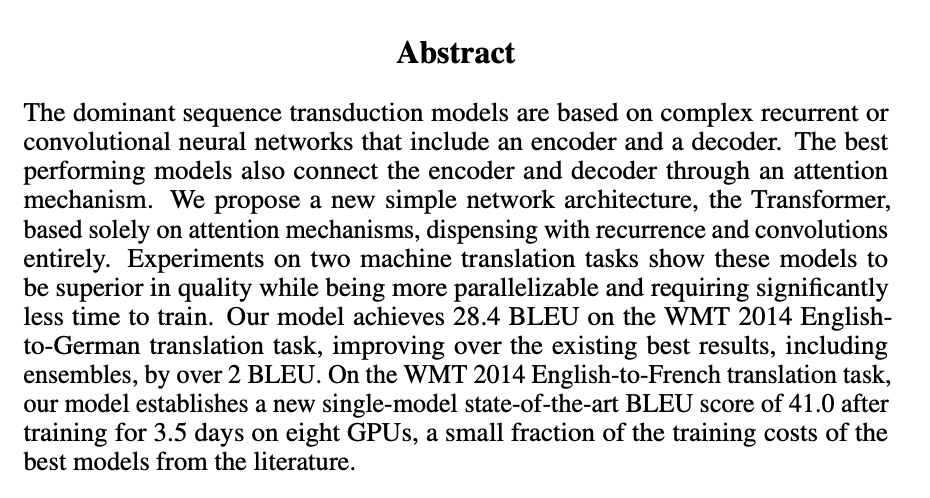

# 《The Elements of Style》第二章：规则 12–17

原文是 Strunk & White **第四版**第二章 *Elementary Principles of
Composition*。规则 12–17
依次讨论整体结构、段落、主动语态、肯定式表达、具体语言和删减冗词；1918/1920
年原版的编号有所不同。([Pearson](https://www.pearson.com/en-gb/subject-catalog/p/Strunk-Elements-of-Style-The-Pearson-New-International-Edition-4th-Edition/P200000005508?utm_source=chatgpt.com "Elements of Style, The, Pearson New International Edition"))

这六条规则实际上构成了一个从宏观到微观的写作系统：

> **Design → Paragraph → Agency → Claim → Evidence → Compression**
> 全文结构 → 段落单位 → 谁执行动作 → 明确说什么成立 → 给出具体证据 →
> 删除无效文字

以下案例选自城市科学和计算机科学中的高影响力论文，包括 PNAS、Nature
Communications、NeurIPS、CVPR、NAACL 和 *Computers, Environment and
Urban Systems*。

------------------------------------------------------------------------

## Rule 12：先选择文章结构，再保持结构一致

### 核心含义

写之前先确定信息按照什么顺序出现。论文摘要最常用的结构是：

$$\text{Problem} \rightarrow \text{Gap} \rightarrow \text{Method}
\rightarrow \text{Evidence} \rightarrow \text{Implication}$$

最常见的问题是句子本身没有语法错误，但功能顺序混乱：一会儿讲意义，一会儿讲方法，又跳回背景。

### 计算机科学案例：*Attention Is All You Need*

其摘要遵循非常稳定的设计：

1.  现有序列模型主要依赖 recurrent 或 convolutional architectures；
2.  提出仅依赖 attention 的 Transformer；
3.  在两个机器翻译任务上实验；
4.  报告 28.4 和 41.0 BLEU，以及训练效率。

每个句子承担一个明确功能，没有在方法之后重新介绍研究背景。([NeurIPS
会议论文集](https://proceedings.neurips.cc/paper_files/paper/2017/file/3f5ee243547dee91fbd053c1c4a845aa-Paper.pdf?utm_campaign=news&utm_medium=nationaltribune&utm_source=nationaltribune "Attention is All you Need"))

### 城市科学案例：Louail et al.

该论文的摘要结构同样清晰：

1.  OD matrices 信息完整，但难以比较；
2.  提出一个 (2\times2) coarse-grained signature；
3.  应用于 31 个西班牙城市的 mobile-phone OD data；
4.  区分 integrated flows 与 random flows；
5.  用于比较和分类城市通勤结构。([Nature](https://www.nature.com/articles/ncomms7007 "Uncovering the spatial structure of mobility networks | Nature Communications"))

### 教学改写

**结构混乱：**

> Urban mobility is important for planning. We use mobile-phone data
> from 31 cities. Cities have different commuting structures. We propose
> a matrix-based method, and the results may support urban analysis.

问题在于背景、数据、发现和方法交叉出现。

**结构稳定：**

> Origin–destination matrices preserve commuting flows but are difficult
> to compare across cities. We compress each matrix into a (2\times2)
> signature that separates four flow categories. We apply the
> representation to mobile-phone data from 31 Spanish cities. The
> resulting signatures distinguish commuting structures and reveal
> systematic variation with city size.

写摘要前，可以先给每句话分配角色：

| Sentence | Function                    |
|----------|-----------------------------|
| S1       | Problem or gap              |
| S2       | Proposed method             |
| S3       | Data and experiment         |
| S4       | Main quantitative result    |
| S5       | Contribution or implication |

不要写到第三句才决定摘要要讲什么。

------------------------------------------------------------------------

## Rule 13：把段落作为基本写作单位

### 核心含义

一个段落应当围绕**一个可辩护的中心命题**展开。这里的“一段一个主题”还不够准确，更好的理解是：

> **One paragraph, one argumentative job.**

一个完整的学术段落通常包含：

[ \text{Claim} \rightarrow \text{Evidence}
\rightarrow \text{Interpretation} \rightarrow \text{Transition}]

### 城市科学案例：城市尺度律

Bettencourt et al.
的摘要围绕一个中心命题展开：城市指标与人口之间存在系统性的 scaling
relations。

随后给出两类具体证据：

- wealth creation 和 innovation：(\beta\approx1.2)，superlinear；
- infrastructure：(\beta\approx0.8)，sublinear。

最后解释这些关系对城市生活节奏、创新和城市增长的含义。证据都服务于“城市系统存在不同
scaling regimes”这一中心，而不是并列罗列城市现象。([PubMed Central
(PMC)](https://pmc.ncbi.nlm.nih.gov/articles/PMC1852329/?utm_source=chatgpt.com "Growth, innovation, scaling, and the pace of life in cities - PMC"))

### 计算机科学案例：BERT

BERT 摘要也可以视为一个完整的论证单元：

- 命题：bidirectional pre-training 能产生通用语言表示；
- 机制：同时利用 left 和 right context；
- 下游方式：只增加一个输出层即可 fine-tune；
- 证据：在 11 个 NLP tasks 上取得新结果，并报告 GLUE、MultiNLI 和 SQuAD
  指标。([ACL
  Anthology](https://aclanthology.org/N19-1423/ "BERT: Pre-training of Deep Bidirectional Transformers for Language Understanding - ACL Anthology"))

### 常见错误

一个段落同时写：

> We construct a pedestrian graph from OpenStreetMap. Elevation affects
> walking behavior. Our model improves prediction accuracy. However,
> elevators are missing from the dataset. Urban accessibility is
> important for equity.

这里混合了五项工作：

- 数据构建；
- 理论依据；
- 实验结果；
- 数据局限；
- 社会意义。

更合理的拆分是：

- Paragraph 1：graph construction；
- Paragraph 2：slope-aware impedance；
- Paragraph 3：prediction results；
- Paragraph 4：limitations and implications。

判断是否需要另起一段，可以问：

> 如果删除第一句，后面的句子是否仍然在回答同一个问题？

如果不能，通常意味着段落包含了多个论证任务。

------------------------------------------------------------------------

## Rule 14：优先使用主动语态

### 核心含义

主动语态让读者立即知道：

- 谁做了什么；
- 哪一步是作者的贡献；
- 哪一步由模型、数据或实验完成。

ResNet 摘要直接由作者作为行动主体，说明其提出 residual learning
framework，用来缓解深层网络训练困难。这比 “a framework was developed”
更容易识别论文贡献。([CVF Open
Access](https://openaccess.thecvf.com/content_cvpr_2016/html/He_Deep_Residual_Learning_CVPR_2016_paper.html?utm_source=chatgpt.com "Deep Residual Learning for Image - CVF Open Access"))

OSMnx 的写法也适合工程和城市计算论文：工具本身可以充当主语——OSMnx
downloads、constructs、corrects、analyzes 和 visualizes street
networks。动词直接对应系统能力。([科学直通车](https://www.sciencedirect.com/science/article/abs/pii/S0198971516303970?utm_source=chatgpt.com "OSMnx: New methods for acquiring, constructing ..."))

### 对比

**弱：**

> A graph-based model was developed, and experiments were conducted on
> three datasets.

读者不知道是谁做的，也不知道实验具体评估什么。

**强：**

> We develop a graph-based model and evaluate it on three mobility
> datasets.

还可以避免连续使用 `we`：

> The encoder represents the pedestrian network. The decoder predicts
> hourly link flows. Our experiments compare the model with four
> baselines.

### 科研写作中的例外

主动语态是默认选择，不是绝对规则。下列情况可以使用被动语态：

> The trajectories were sampled every five minutes.

这里研究对象和处理过程比执行者更重要。

更实用的分工是：

- `We`：研究选择、贡献、论证；
- `The model`：模型操作；
- `The data/results`：证据所显示的内容；
- passive voice：标准流程或行动者无关紧要的过程。

尽量减少：

> It was found that... It was observed that... It was decided that...

通常可以直接写：

> The results show that... We observe that... We therefore select...

------------------------------------------------------------------------

## Rule 15：用肯定形式陈述

### 核心含义

优先告诉读者**什么成立、模型做什么、证据支持什么**，而不只是说明它“不是什么”或“没有什么问题”。

### 计算机科学案例

较弱的定义：

> The Transformer does not use recurrent or convolutional layers.

它只告诉读者模型排除了什么。

更完整的定义：

> The Transformer models sequence dependencies with attention mechanisms
> alone.

需要比较时，再补充否定信息：

> It therefore removes recurrent and convolutional components.

Transformer 原摘要正是先给出模型的正面身份，再用与 recurrence 和
convolution 的差异强化贡献。([NeurIPS
会议论文集](https://proceedings.neurips.cc/paper_files/paper/2017/file/3f5ee243547dee91fbd053c1c4a845aa-Paper.pdf?utm_campaign=news&utm_medium=nationaltribune&utm_source=nationaltribune "Attention is All you Need"))

### 城市科学案例

**否定式：**

> OD matrices are no longer difficult to compare.

**肯定式：**

> The (2\times2) signature represents each mobility network with four
> flow categories.

后者告诉读者方法具体做了什么。([Nature](https://www.nature.com/articles/ncomms7007 "Uncovering the spatial structure of mobility networks | Nature Communications"))

### Limitations 也应使用肯定式

只写：

> Our dataset does not contain informal trips.

信息没有闭合。更好的写法是：

> The dataset records formal commuting trips but omits informal travel;
> we therefore restrict our conclusions to observed commuting flows.

它依次说明：

1.  数据包含什么；
2.  缺少什么；
3.  缺失如何限制结论。

------------------------------------------------------------------------

## Rule 16：使用确切、具体、可验证的语言

### 核心含义

科研写作中的 concrete language 不一定是视觉化语言，而是能够对应到：

- 明确对象；
- 空间与时间尺度；
- 数据规模；
- 模型操作；
- baseline；
- metric；
- effect size；
- uncertainty。

### 城市科学案例

Louail et al. 没有只说“分析了多个城市的大规模 mobility
data”，而是明确说明：

- 31 Spanish cities；
- mobile-phone-derived OD matrices；
- (2\times2) representation；
- four flow
  categories。([Nature](https://www.nature.com/articles/ncomms7007 "Uncovering the spatial structure of mobility networks | Nature Communications"))

Bettencourt et al.
也没有只说“城市规模影响创新和基础设施”，而是给出不同类别的 scaling
exponents：约 (1.2) 与
(0.8)。([PubMed](https://pubmed.ncbi.nlm.nih.gov/17438298/?utm_source=chatgpt.com "Growth, innovation, scaling, and the pace of life in cities"))

### 计算机科学案例

Transformer 摘要报告：

- WMT 2014 English–German；
- 28.4 BLEU；
- English–French；
- 41.0 BLEU；
- eight GPUs；
- 3.5 days。

这些信息让“better”变成了可检查的经验命题。([NeurIPS
会议论文集](https://proceedings.neurips.cc/paper_files/paper/2017/file/3f5ee243547dee91fbd053c1c4a845aa-Paper.pdf?utm_campaign=news&utm_medium=nationaltribune&utm_source=nationaltribune "Attention is All you Need"))

### 从模糊到具体

**模糊：**

> Our model performs well on large-scale urban data.

**稍好：**

> Our model improves pedestrian-flow prediction.

**可验证：**

> On hourly 250-m OD grids, the model reduces MAE by **[x%]** relative
> to **[baseline]** across **[k]** spatial holdouts.

写结果时，至少回答：

[ \text{Where? When? On what data? Compared with what? By how much?}]

但要避免 **false
precision**。没有可靠测量时，不要为了显得具体而虚构小数。`approximately`、confidence
interval 和误差范围经常是必要信息。

------------------------------------------------------------------------

## Rule 17：删除没有承担功能的词

### 核心含义

删词的标准并不是“让句子尽可能短”，而是：

> 删除后，命题、条件、证据和语气是否保持不变？

### 常见冗余

| 冗余表达                                 | 更直接的表达       |
|------------------------------------------|--------------------|
| in order to                              | to                 |
| due to the fact that                     | because            |
| it is worth noting that                  | 删除               |
| has the ability to                       | can                |
| a total of 31 cities                     | 31 cities          |
| the results of the experiments show that | experiments show   |
| in the context of urban areas            | in cities          |
| a novel new framework                    | a novel framework  |
| various different datasets               | different datasets |

### 改写

**冗长：**

> In this paper, we aim to propose a novel new framework that has the
> ability to predict the future mobility conditions of urban areas.

**精简：**

> We propose a framework to predict urban mobility.

如果任务和时间范围很重要：

> We propose a conditional graph model to predict hourly pedestrian
> flows under local network interventions.

BERT 摘要的高效之处在于迅速完成“模型定义—pre-training
mechanism—downstream transfer—quantitative results”，没有长篇介绍 NLP
的一般重要性。([ACL
Anthology](https://aclanthology.org/N19-1423/ "BERT: Pre-training of Deep Bidirectional Transformers for Language Understanding - ACL Anthology"))

### 不能删除的词

科研写作中，下列词有时看似拖沓，实际上承担有效限定：

- `on average`
- `approximately`
- `under these assumptions`
- `within the study area`
- `statistically significant`
- `is associated with`
- `may`
- `conditional on`

例如不能为了简洁，把：

> Street connectivity is associated with pedestrian activity.

改成：

> Street connectivity increases pedestrian activity.

后一句加入了原证据未必支持的因果关系。

------------------------------------------------------------------------

# 综合示例：城市科学摘要

根据 Louail et al. 的研究内容，可以写成：

> Origin–destination matrices preserve detailed commuting flows but are
> difficult to compare across cities. We represent each matrix with a
> (2\times2) signature that partitions flows into four categories.
> Applied to mobile-phone OD data from 31 Spanish cities, the
> representation distinguishes integrated and random flows and shows
> that the share of random flows increases with city size. The resulting
> signatures support compact comparison and classification of urban
> commuting structures.
> ([Nature](https://www.nature.com/articles/ncomms7007 "Uncovering the spatial structure of mobility networks | Nature Communications"))

这四句话同时满足六条规则：

- **Rule 12**：problem → method → data/result → contribution；
- **Rule 13**：整个段落只回答“如何比较城市 mobility networks”；
- **Rule 14**：`We represent`，行动主体明确；
- **Rule 15**：说明表示方法做什么；
- **Rule 16**：(2\times2)、four categories、31 cities；
- **Rule 17**：没有 `it is important to note that` 等空壳表达。

# 综合示例：计算机科学摘要

> Sequence transduction models commonly depend on recurrent or
> convolutional components. The Transformer models input–output
> dependencies with attention alone. On WMT14 translation tasks, it
> reaches 28.4 BLEU for English–German and 41.0 for English–French while
> requiring substantially less training time than previous systems.
> ([NeurIPS
> 会议论文集](https://proceedings.neurips.cc/paper_files/paper/2017/file/3f5ee243547dee91fbd053c1c4a845aa-Paper.pdf?utm_campaign=news&utm_medium=nationaltribune&utm_source=nationaltribune "Attention is All you Need"))

其中真正值得学习的不是单句“高级”，而是信息组织极其稳定：

[ \text{Existing design} \rightarrow \text{New design} \rightarrow
\text{Measured evidence}]

------------------------------------------------------------------------

## 写完摘要后的六项检查

1.  **Design**：句子是否按照 problem、method、result、contribution
    的顺序出现？
2.  **Paragraph**：这一段是否只承担一个论证任务？
3.  **Active voice**：读者是否知道谁执行了关键动作？
4.  **Positive form**：是否清楚说明方法做什么、结果支持什么？
5.  **Concrete language**：是否写明数据、尺度、baseline、metric 和
    effect size？
6.  **Concision**：哪些词删除后不会损失事实、限定条件或不确定性？

规则 12–17 的核心并非简单追求“短句”，而是让论文形成一条可追踪的证据链：

[ \boxed{
\text{结构明确}
\rightarrow
\text{段落单一}
\rightarrow
\text{动作清楚}
\rightarrow
\text{命题直接}
\rightarrow
\text{证据具体}
\rightarrow
\text{表达紧凑}
}]
